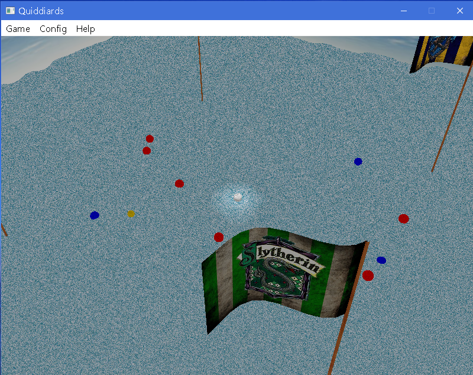
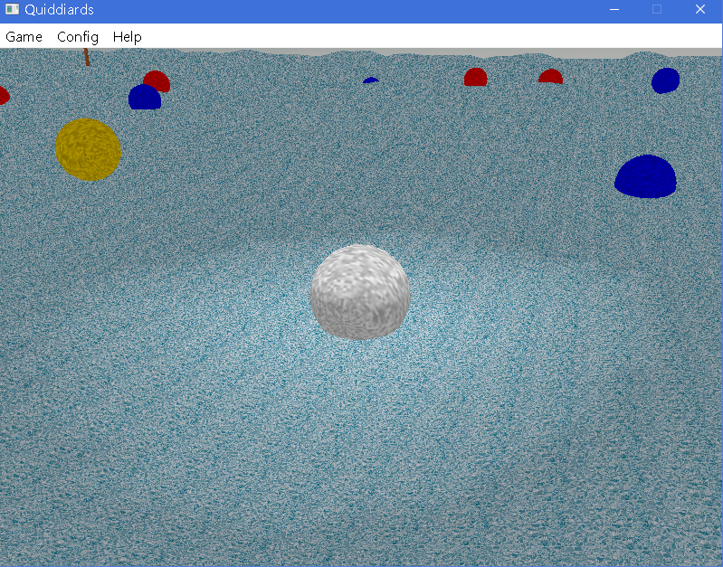

# Quiddiards

School project for the course *Computer Graphics*  
A Combination of Quidditch and Billiards.  
Implemented in OpenGL.  
Featured in realistic physics of rigid body and natural-looking textures.  

## Note:
Some Qt dlls are required. There is also some problem with the texture. You can clone the project and build it by yourself to see what the scene really looks like.

## Screenshots

## Relative Links
[Repo](https://github.com/silencious/Quiddiards)  
[Release](https://github.com/silencious/Quiddiards/releases)  

## Feel free to download an play!
